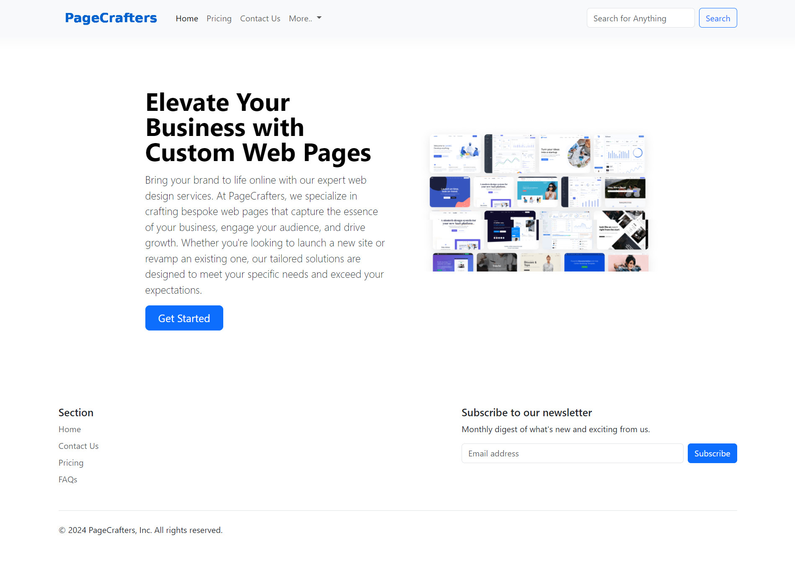
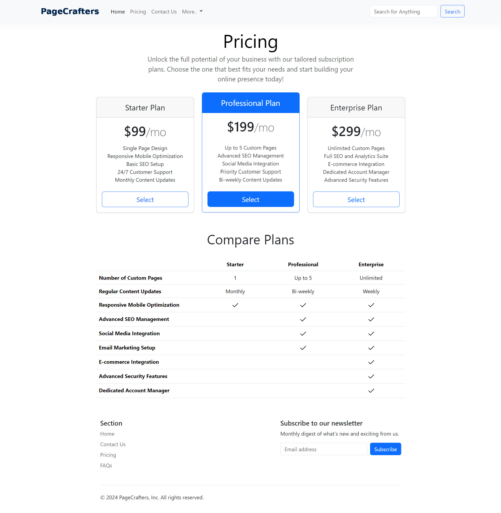
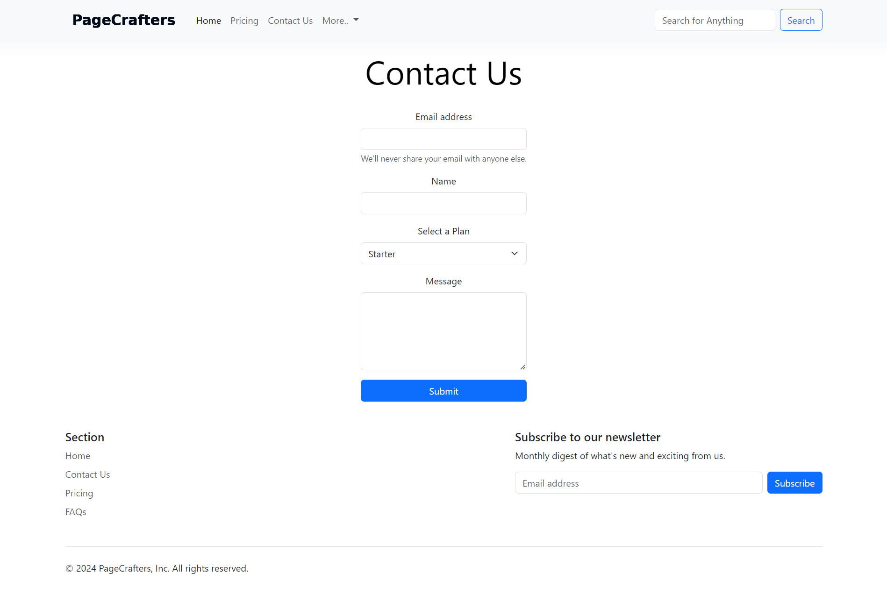

# PageCrafters

PageCrafters is a conceptual web design platform built with HTML, CSS, and Bootstrap as part of a skill-based assignment for Per Scholas.

## Features

- **Bootstrap**: Utilized for responsive layout and styling to ensure the website looks great on all devices.
- **Custom CSS**: Enhances visual elements.

## Live Site

[View Live Site](https://pagecrafters-bootstrap.vercel.app/)

## Getting Started

To view the website, simply open the `index.html` file in your web browser.

## Screenshots

